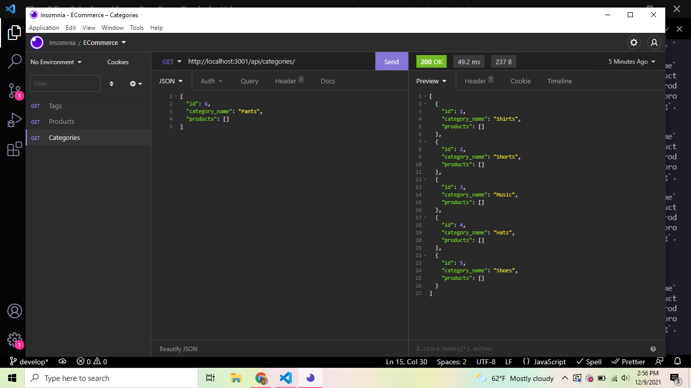

# Fantastic Umbrella ☂️

## Description

* Fantastic Umbrella is a back end project to help practice mysql and sequelize databases! We were provided with the starter code and it was our job to create a database for an ecommerce store. 
* To create the database, my first step was making sure the schema was correct, and that we had an .env to log into mysql safely.
* After the initial database was created, I ten went in and filled out our Model classes for Categories, Products, Tags and Product Tags. Once the Models were finished I used sequelize to create associations between the models.
* The next step was to create our API routes, making sure we followed CRUD and being able to create, read, update and delete.
* After all our code was finshed I tested everything in Insomnia to ensure that everything worked!

## Table of Contents

* [Usage](#usage)
* [Credits](#credits)
* [License](#license)

## Usage

To use, download the code and install the necessary npm packages. In the terminal, make sure the database is created and then seed it with npm start and npm seed. Then open insomnia to test out the different routes!

### Screenshot

### Links

* [VideoDemo](https://drive.google.com/file/d/17KQKeDx8aHwkQs_WgqZ4J5_6tEBnVY54/view) - link to video walkthrough demonstration
* [GitHub](https://github.com/HaileyThomas/fantastic-umbrella) - link to GitHub project

## Credits

* ASU Coding Bootcamp for the starter code
* MySQL, Sequelize, and Dotenv

## License

[License](https://opensource.org/licenses/MIT) - link to license

MIT License

Copyright (c) [2021] [Hailey Thomas]

Permission is hereby granted, free of charge, to any person obtaining a copy
of this software and associated documentation files (the "Software"), to deal
in the Software without restriction, including without limitation the rights
to use, copy, modify, merge, publish, distribute, sublicense, and/or sell
copies of the Software, and to permit persons to whom the Software is
furnished to do so, subject to the following conditions:

The above copyright notice and this permission notice shall be included in all
copies or substantial portions of the Software.

THE SOFTWARE IS PROVIDED "AS IS", WITHOUT WARRANTY OF ANY KIND, EXPRESS OR
IMPLIED, INCLUDING BUT NOT LIMITED TO THE WARRANTIES OF MERCHANTABILITY,
FITNESS FOR A PARTICULAR PURPOSE AND NONINFRINGEMENT. IN NO EVENT SHALL THE
AUTHORS OR COPYRIGHT HOLDERS BE LIABLE FOR ANY CLAIM, DAMAGES OR OTHER
LIABILITY, WHETHER IN AN ACTION OF CONTRACT, TORT OR OTHERWISE, ARISING FROM,
OUT OF OR IN CONNECTION WITH THE SOFTWARE OR THE USE OR OTHER DEALINGS IN THE
SOFTWARE.

## Questions

Please feel free to contact me if you have any questions!

### Contact

* [Email](mailto:haileyraebeauty@gmail.com) - Email Hailey Thomas : haileyraebeauty@gmail.com
* [GitHub](https://github.com/HaileyThomas) - GitHub username : HaileyThomas